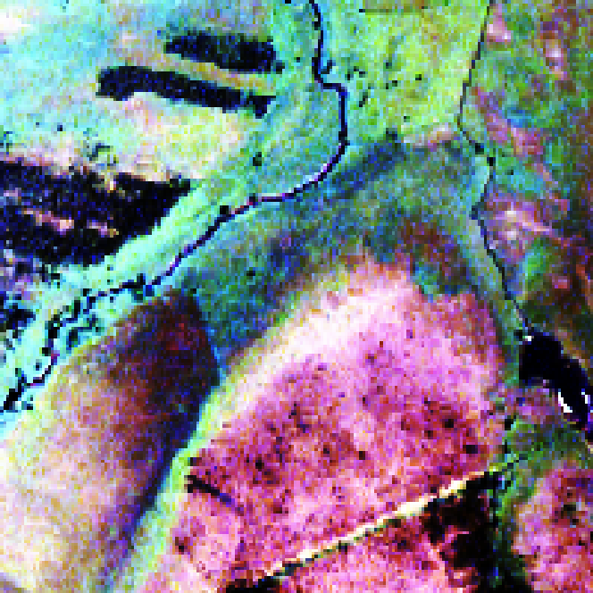
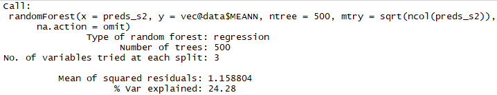
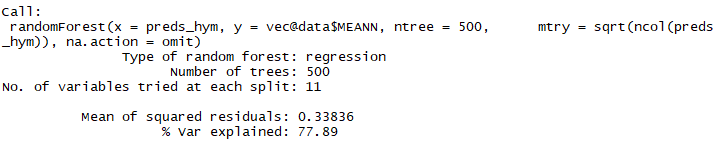
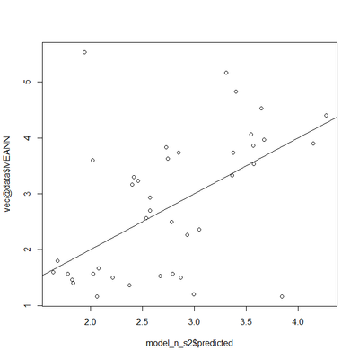
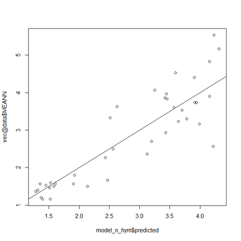
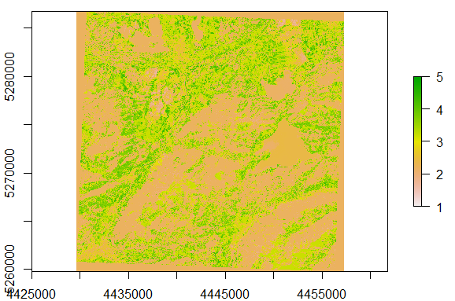
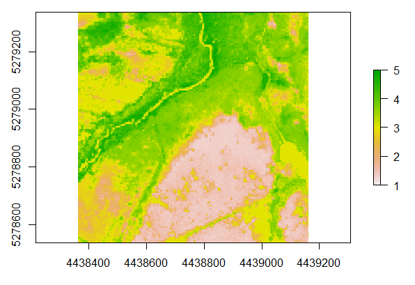
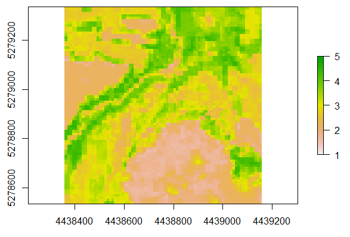

## Mapping Ellenberg values using a RandomForest regression and two types of optical remote sensing datasets ##

### Overview ###

In this lecture you will learn how to apply RandomForest in a regression scenario. The learned steps will include:

- Loading a hyperspectral and a Sentinel-2 image
- Visualizing a hyperspectral and a Sentinel-2 image
- Loading a reference datset containing Ellenberg indicator values collected in the field
- Building a RandomForest model between the Ellenberg values and the spectral information of the remote sensing datasets
- Predicting the RandomForest model to the full image

The datasets applied in this tutorial are available here:

[https://drive.google.com/open?id=16HZiL0AltUr7ftNMviLIrHfb5Y9vTGCu](https://drive.google.com/open?id=16HZiL0AltUr7ftNMviLIrHfb5Y9vTGCu)

### Datasets used in this Tutorial ###

In this tutorial we will use a Sentinel-2 image which has been preprocessed as described in the following Tutorial: 

ADD LINK

The image used in the Tutorial has additionally been re-projected to a German coordinate reference system (EPSG-code: 31468) in QGIS.

The original Sentinel-2 dataset can be downloaded from several webpages including the USGS Earth explorer (the same webpage where we downloaded our Landsat data), as well as the official ESA Science Data Hub. How to download the corresponding images will be demonstrated in the course. The links can be found in below as well as on the ILIAS page of the course:

[https://earthexplorer.usgs.gov/](https://earthexplorer.usgs.gov/) .

ADD LINK

Furthermore, we will make use of an airborne hyperspectral or imaging spectroscopy image that was collected with the HyMap sensor. This dataset is comparable to a multispectral image but contain a lot more bands which continuously cover the spectra wavelengths regions between approximately 400 and 2400 nm. The HyMap dataset has a  higher spatial resolution as compared to the Sentinel-2 image. 

The field reference data and the hyperspectral data for this tutorial are the data sets used in Schmidtlein, S., Zimmermann, P., Schüpferling, R., Weiß, C. (2007): Mapping the floristic continuum: Ordination space position estimated from imaging spectroscopy. Journal of Vegetation Science 18(1), pp. 131–140.

### Step 1: Loading the Sentinel-2, the HyMap (hyperspectral) and the reference data ###

As first step, load all necessary R packages by executing the following code:

	require(raster)
	require(rgdal)
	require(randomForest)

R will give you a warning message in case a package is not installed yet. If this is the case, please install the packages either through the main menu of Rstudio by selecting **"Tools" =>** **"Install packages"** and then following the appearing dialogue, or by entering the corresponding R code to install the packages into the console. E.g., to install the package "raster" use the code:

	install.packages("raster")	

After all packages are successfully installed, load the images using two steps. First, change the path to the folder containing the image, then execute the stack command to load the image. To check whether you are in the correct folder, you can display all files of the folder using the **list.files()**-command:

	setwd("D:/Remote_sensing/Tutorial_5_RandomForest")
	list.files()
	# to load the Sentinel-2 image
	s2_img <- stack("s2_murnau.tif")
	# to load the HyMap image
	hym_img <- stack("murnau.hymap")

We can then have a look at the two loaded images by running:

	plotRGB(s2_img, r=3, g=2, b=1, stretch="hist")
	plotRGB(hym_img, r=14, g=7, b=2, stretch="hist")

This will result in the following two plots:

Finally, we will also add the reference dataset which is stored in a Shapefile:

	vec <- readOGR(".", "murnau_fin")

We can check the location of the sample plots in the field by plotting:

	plot(vec, add=T)

Which adds the field plots to the last plot of the HyMap-image:

If you want, you can also re-plot the Sentinel-2 image and add the field-plot location to the Sentinel-2 image. You will quickly find out, that the Sentinel-2 image is covering a much larger area than the HyMap image. If you want to have better comparable maps at the end of the Tutorial, you can clip the Sentinel-2 image to the extent of the HyMap image, using R commands that you already learnt in earlier Tutorials.

### Step 2: Extracting the spectral information at the plot locations and train the RandomForest model ###

Next, we will first extract the spectral information of the pixels that overlap with the locations of the field sampling plots by running:

	preds_s2 <- extract(s2_img, vec)
	preds_hym <- extract(hym_img, vec)

Then, we will build the RandomForest model between the Ellenberg indicator values stored in reference dataset and the spectral information we just extracted.The first model will use the N indicator value stored in the attribute table of the Shapefile which can be accessed here:

	vec@data$MEANN 

The N indicator value stands for "Nitrogen" and high values indicate locations with a high availability of Nitrogen (one indicator for good plant growth), while low values indicate areas where N is sparse (nutrient limited environment). See also:  [https://owlcation.com/stem/Understanding-Ellenberg-Indicator-Values-For-Beginners](https://owlcation.com/stem/Understanding-Ellenberg-Indicator-Values-For-Beginners)

To train the model for Sentinel-2 data we run:
	
	# use set.seed() to be able to reproduce the outputs (RandomForest contains some random components and will otherwise always lead to a slightly different results)
	set.seed(3)
	model_n_s2 <- randomForest(preds_s2, vec@data$MEANN, ntree = 500, mtry=sqrt(ncol(preds_s2)), na.action = omit)

As you can see, we are setting two variables to parameterize the RandomForest algorithm: **ntree**, which is the number of trees to be grown and where a default value of 500 is used and **mtry** which indicates the number of random predictor variables that are tried-out at each node-split of the decision trees (compare theoretical lecture on RandomForest heard in the course). For **mtry** we also use the recommended standard value which is the square-root of the number of predictors used to train the model.

To train a similar model for the HyMap data, we run:

	model_n_hym <- randomForest(preds_hym, vec@data$MEANN, ntree = 500, mtry=sqrt(ncol(preds_hym)), na.action = omit)

To compare the performance of the two models, we can have a look at the out-of-bag error of RandomForest by simply calling the variable in which the model was stored:

	model_n_s2
	model_n_hym

This will give the following two outputs:
	
For Sentinel-2:

For HyMap:

We can see that int he given case, the HyMap data performed notably better than the Sentinel-2 data. This may have several reasons in the given example - one potential problem is that the Sentinel-2 data was acquired more than 10 years later than the field data. That is, some changes might have occurred in the vegetation composition in the meantime - even though the ecosystem can be considered rather stable. Furthermore, the HyMap data provides notably more spectral information which may also be crucial to sucessfully map the subtle changes in the vegetation composition that finally explain the variance in N indicator values. Finally, the differences in spatial resolution of the two datasets (4 m vs. 10 m) could also lead to some problems as the field datasets used to calibrate the models were not necessarily representative for a complete 10 x 10 m area.

Let us have a closer look at the results by producing some scatterplots between the values estimated the model and the reference values.

For Sentinel-2, we run:

	dev.off()
	plot(model_n_s2$predicted, vec@data$MEANN)
	abline(0,1)

Correspondingly, for HyMap we run:

	dev.off()
	plot(model_n_hym$predicted, vec@data$MEANN)
	abline(0,1)

This leads to the following two plots:

Here we can see, that eventhough the HyMap data shows a lot stronger correlation with N indicator values obtained from the field data, Sentinel-2 seems to still have a reasonably well correlation and might have some potential for mapping the Ellenberg N values.

### Step 3: Apply the RandomForest models to the full image ###

As last step of this Tutorial, we will now apply the trained RandomForest models to the full extent of the satellite and airborne remote sensing datasets to obtain maps showing estimations of the N indicator value for the full image.

To accomplish this we run:

	# apply randomforest model to the complete image
	pred_n_s2 <- predict(s2_img, model_n_s2, type="response", na.action = omit)
	pred_n_hym <- predict(hym_img, model_n_hym, type="response", na.action = omit)

To have a look at the predicted maps, we run:
	
	# plot prediction map
	plot(pred_n_s2, zlim=c(1,5))
	plot(pred_n_hym, zlim=c(1,5))

This will result in the following two plots:
	

As the Sentinel-2 image covers a notably larger region than the HyMap image, the two images are hardly comparable. Hence, we crop the Sentinel-2 prediction map to the same extent as the HyMap prediction map by running:

	pred_n_s2_sm <- crop(pred_n_s2, extent(pred_n_hym))

The cropped image has now the same extent as the HyMap image and is directly comparable by running:

	plot(pred_n_s2_sm)

Leading to the following plot:

We can now see, that eventhough the RandomForest model for the Sentinel-2 data performed notably worse than the HyMap image, the general trends in the prediction maps, are still quite comparable. 

One more important point to be considered in the predicted maps is that the validity of the model only applies for areas that are comparable to the areas in which reference data were  collected. In the example this relates to the bog-areas of the "Murnauer Moos" stocked with vegetation. The large-area predictions of the Sentinel-2 image are hence not likely to contain meaninful results. In other words: If I train a RandomForest model to predict N values with reference data collected in grasslands and apply this modle to a forest or a river, the results will not make any sense.

Finally, we can save the output maps to raster-file by running:

	# save prediction
	writeRaster(pred_n_s2, filename = "rf_predicted_n_s2.tif", format="GTiff")
	writeRaster(pred_n_s2_sm, filename = "rf_predicted_n_s2_sm.tif", format="GTiff")
	writeRaster(pred_n_hym, filename = "rf_predicted_n_hym.tif", format="GTiff")

### Exercise ###

To practice the just learned steps a bit more, you can try to build additional RandomForest models for the other Ellenberg indicator values available in the reference datasets. You can access for example the F values (wetness) at:

	vec@data$MEANF

And the R values (pH) at:

	vec@data$MEANR

Furthermore, you can try to examine how adding additional Sentinel-2 scenes collected at different times during the vegetation season influence the model results. To accomplish this, you will have to download some additional Sentinel-2 scenes, pre-process them using the SNAP-Toolbox and finally reproject them to the coordinate reference system indicated above. Then you can stack them into a single raster-stack and repeat the analysis. It might be good to also clip the dataset to approximately the area covered by the field-data to speed-up the data processing.
